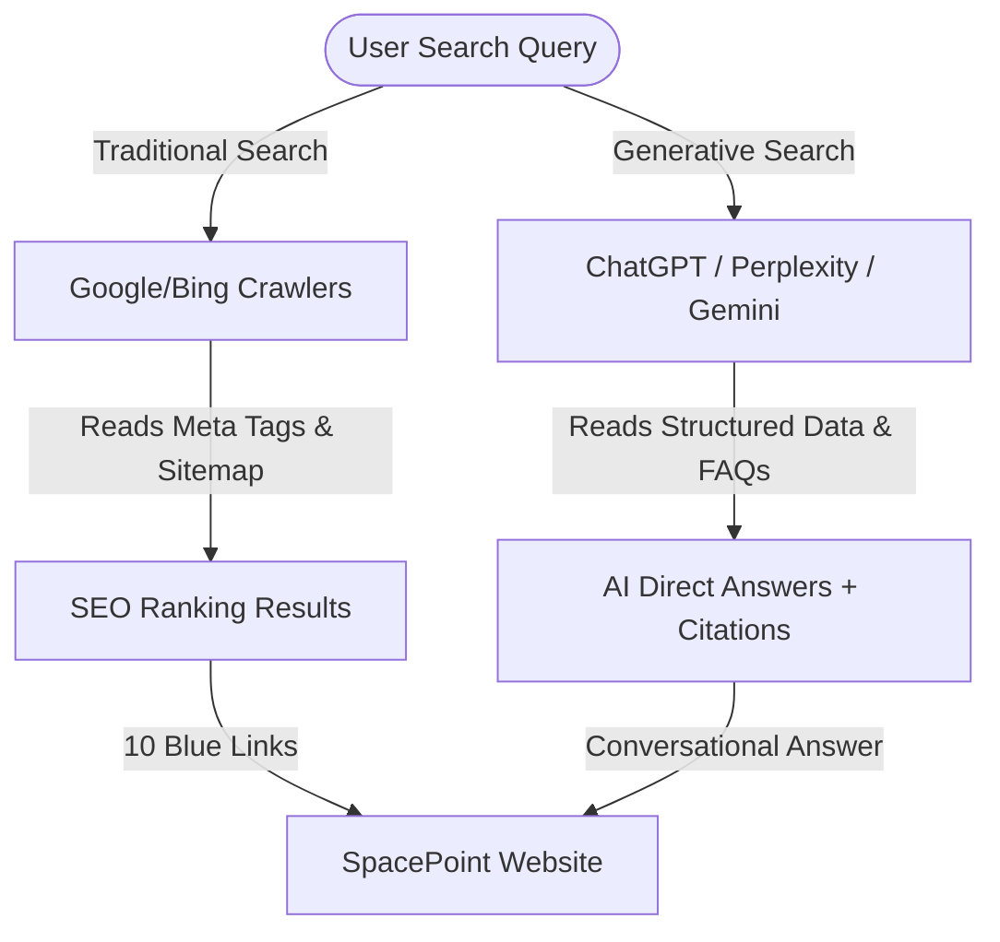

# SpacePoint SEO & AEO Strategy Report
**Document Type:** Corporate Executive Briefing  
**Target Audience:** CEO, SpacePoint  
**Prepared by:** Technical & Digital Optimization Team  
**Date:** May 17, 2026  

---

## 1. Executive Summary

As SpacePoint continues to scale as the premier space education and satellite engineering provider in the UAE and GCC, our digital footprint must match our physical excellence. In the modern web ecosystem, discoverability is no longer just about ranking links on Google; it is about powering the answers given by AI systems.

This report outlines the comprehensive **Search Engine Optimization (SEO)** and **Answer Engine Optimization (AEO)** architecture implemented across the SpacePoint landing page and associated portals. 

### Key Accomplishments:
1. **Full Site Coverage**: Standardized title tags, custom meta descriptions, and page-specific high-intent keywords across all **13 core pages**.
2. **AI Answer Engine Readiness (AEO)**: Implemented advanced JSON-LD structured data (including `EducationalOrganization`, `Course`, `FAQPage`, and `Store` schemas) to guarantee that AI models (ChatGPT, Perplexity, Google Gemini, and Claude) cite SpacePoint as the definitive source of space education in the GCC.
3. **Google Analytics 4 (GA4) Integration**: Unified tracking (`G-LZSXTHGZW0`) deployed on every single page with **Enhanced Measurement** active to analyze user journeys, page-specific traffic, and booking form conversions.
4. **Perfect Indexability**: Standardized `sitemap.xml` priority hierarchies and `robots.txt` configurations for smooth search crawler navigation.

---

## 2. SEO vs. AEO: The Strategic Paradigm Shift

To maintain a competitive edge, SpacePoint has moved from a traditional search strategy to a dual-engine discovery model:



### Search Engine Optimization (SEO)
* **Goal**: Rank on the first page of traditional search engines (Google, Bing) for high-intent search queries.
* **Mechanism**: Custom titles, descriptive page URLs, canonical tags, optimized headings (`<h1>`, `<h2>`), and mobile-responsive performance.
* **Result**: High organic search CTR (Click-Through Rate) for prospective schools, universities, and partners looking to buy educational programs or kits.

### Answer Engine Optimization (AEO)
* **Goal**: Serve as the direct source of facts for Large Language Models (LLMs) that aggregate web content to answer complex conversational prompts.
* **Mechanism**: Structured JSON-LD markup and crawlable Q&A (FAQs) written in clear, declarative formats that machines can easily parse.
* **Result**: When a principal asks ChatGPT, *"What is the best satellite education program for schools in Dubai?"*, ChatGPT retrieves our schema, summarizes our programs (Quick Flight, Shallow Flight, etc.), and displays **SpacePoint** as the direct cited answer.

---

## 3. SEO Optimization Map (Page-by-Page)

Each page has been customized with dedicated title tags, descriptive snippets (meta descriptions), and high-intent GCC educational keywords to maximize search capture.

| Page URL | Title Tag | Meta Description | Target Keywords |
| :--- | :--- | :--- | :--- |
| **`index.html`** | SpacePoint \| UAE Space Education & Satellite Engineering Workshops | SpacePoint delivers hands-on space education, satellite engineering workshops, and CubeSat learning for schools, universities, and institutions across the UAE and GCC. | space education, satellite engineering, CubeSat workshops, STEM education UAE, GCC space programs, space learning, student missions |
| **`about.html`** | About SpacePoint \| UAE Space Education Mission | Learn about SpacePoint's mission to make space education practical, accessible, and inspiring for students across the UAE and GCC through hands-on satellite engineering. | about SpacePoint, space education UAE, satellite engineering for students, CubeSat STEM mission |
| **`programs.html`** | Space Educational Programs & Workshops \| SpacePoint UAE | Discover SpacePoint's hands-on satellite education programs: Quick Flight, Shallow Flight, The Mission, and The Journey. Real space tech for schools and students. | space education programs, satellite workshops, CubeSat learning, STEM courses UAE, SpacePoint training |
| **`book-workshop.html`**| Book a Space Workshop \| SpacePoint UAE | Book a practical satellite engineering workshop or space education program for your school or university with SpacePoint. Join the space innovation journey. | book space workshop UAE, satellite education program, school space camp, STEM workshops GCC, SpacePoint booking |
| **`shop.html`** | SpacePoint Shop \| Ground Station Space Hardware & Kits | Explore Ground Station, SpacePoint's official store for educational satellite kits, space hardware, and premium branded merchandise in the UAE. | SpacePoint shop, ground station, educational satellite kits, space hardware, CubeSat model, space merchandise UAE |
| **`journey.html`** | Our Space Journey \| SpacePoint | Discover the story behind SpacePoint. From a single idea to a growing ecosystem of space innovation, empowering students with hands-on satellite engineering. | SpacePoint story, space education journey, satellite engineering startup UAE, STEM innovation |
| **`team.html`** | Meet Our Team of Space Engineers & Educators \| SpacePoint | Meet the SpacePoint team of engineers, educators, and innovators dedicated to bringing practical satellite engineering to students across the UAE and GCC. | SpacePoint team, space engineers UAE, satellite education experts, STEM educators |
| **`student_mission.html`**| Student Space Missions & Projects \| SpacePoint | Explore the innovative student space missions and satellite projects developed through SpacePoint's educational programs across the UAE and GCC. | student space missions, satellite projects UAE, student CubeSats, STEM projects, SpacePoint missions |
| **`our_platforms.html`**| SpacePoint Portals & Platforms \| Learning Systems | Access SpacePoint's dedicated learning management systems (LMS) and internal portals designed for students, beginners, and space education instructors. | SpacePoint platforms, space education LMS, satellite engineering portal, STEM instructor portal |
| **`resources.html`** | Space Media Resources & Brand Assets \| SpacePoint | Access SpacePoint's media resources, branding guidelines, logos, and monthly newsletters covering the latest in UAE space education and satellite engineering. | SpacePoint resources, space education media, STEM branding, SpacePoint newsletter, satellite engineering news |
| **`media_coverage.html`**| SpacePoint Media Coverage & Press \| UAE Space News | Read the latest news, press releases, and media coverage about SpacePoint and our impact on space education and satellite engineering in the UAE and beyond. | SpacePoint news, space education media, UAE space tech press, satellite startup news |
| **`alumni.html`** | SpacePoint Alumni network \| STEM & Space Careers | Meet the SpacePoint Alumni who have completed our satellite engineering programs and are advancing their careers in the STEM and space industry. | SpacePoint alumni, space education graduates, STEM careers UAE, satellite engineering students |
| **`ambassadors.html`** | Global Space Education Ambassadors \| SpacePoint | Meet the SpacePoint Ambassadors from around the world, dedicated to advancing space exploration and STEM education in their communities. | SpacePoint ambassadors, global space education, STEM leaders, satellite engineering representatives |

---

## 4. AEO & Structured Data (JSON-LD) Implementations

To ensure that AI Answer Engines digest our site perfectly, we have deployed specialized semantic JSON-LD structures. 

### A. Educational Organization Schema (`index.html`)
Identifies SpacePoint as a recognized entity in Dubai, UAE, mapping our social handles and defining our primary offerings.
```json
{
  "@context": "https://schema.org",
  "@type": "EducationalOrganization",
  "name": "SpacePoint",
  "url": "https://spacepoint.ae",
  "logo": "https://spacepoint.ae/assets/img/SpacePoint%20logo.png",
  "description": "SpacePoint is a UAE-based space education company delivering hands-on satellite engineering workshops...",
  "address": {
    "@type": "PostalAddress",
    "addressCountry": "AE",
    "addressRegion": "Dubai"
  },
  "sameAs": [
    "https://www.linkedin.com/company/spacepoint",
    "https://www.instagram.com/spacepoint.ae"
  ]
}
```

### B. FAQ Page Schema (`index.html`)
Provides direct Q&As that search engine rich-snippets display instantly and LLMs copy for zero-click user responses.
```json
{
  "@context": "https://schema.org",
  "@type": "FAQPage",
  "mainEntity": [
    {
      "@type": "Question",
      "name": "What do students learn at SpacePoint?",
      "acceptedAnswer": {
        "@type": "Answer",
        "text": "Students gain hands-on experience in satellite systems, electrical integration, mechanical assembly, software testing..."
      }
    },
    {
      "@type": "Question",
      "name": "What career paths does SpacePoint qualify students for?",
      "acceptedAnswer": {
        "@type": "Answer",
        "text": "Potential pathways include Satellite Engineering, Aerospace Systems, Robotics, AI Engineering, and Technical Entrepreneurship."
      }
    }
  ]
}
```

### C. Course Schema (`programs.html`)
Tells crawlers that our workshops are formal, structured classes, allowing Google's Course Carousel search tool to index them.
```json
{
  "@context": "https://schema.org",
  "@type": "Course",
  "name": "Satellite Engineering Workshops",
  "description": "Hands-on space and satellite education programs ranging from introductory Quick Flight workshops to advanced long-term Mission setups.",
  "provider": {
    "@type": "EducationalOrganization",
    "name": "SpacePoint",
    "url": "https://spacepoint.ae"
  }
}
```

### D. Store Schema (`shop.html`)
Specifies the retail aspect of SpacePoint (Ground Station), mapping out space merchandise and satellite hardware under the parent organization.
```json
{
  "@context": "https://schema.org",
  "@type": "Store",
  "name": "SpacePoint Ground Station",
  "description": "Official store for satellite kits, educational hardware, and branded merchandise by SpacePoint.",
  "url": "https://spacepoint.ae/shop.html",
  "parentOrganization": {
    "@type": "EducationalOrganization",
    "name": "SpacePoint"
  }
}
```

---

## 5. Google Analytics 4 (GA4) Deployment & Actionable Metrics

The site features standard GA4 tracking via **Measurement ID: `G-LZSXTHGZW0`**, integrated globally. 

```
Header Integration Script:
<!-- Google tag (gtag.js) -->
<script async src="https://www.googletagmanager.com/gtag/js?id=G-LZSXTHGZW0"></script>
<script>
  window.dataLayer = window.dataLayer || [];
  function gtag(){dataLayer.push(arguments);}
  gtag('js', new Date());
  gtag('config', 'G-LZSXTHGZW0');
</script>
```

### Automatic Event Tracking (Enhanced Measurement)
GA4 automatically measures user interactions beyond traditional page views. This gives our business comprehensive insight into user engagement without custom code adjustments:

1. **Scroll Depth Tracking**: Automatically records a `scroll` event when a user reaches **90%** of any page. This helps us measure if prospective partners are reading our entire curriculum details or leaving early.
2. **Outbound Click Tracking**: Monitors the exact moment users click social icons (Instagram, LinkedIn) or partner portals.
3. **Site Search Tracking**: Tracks queries searchers input inside the website, revealing exactly what space topics users are looking for.
4. **Form Interactions**: Captures when a user starts filling out the *Launch a Program* booking form or the *Ground Station waitlist registration*, as well as when they complete a successful submission. This is our key business metric for tracking lead generation.
5. **Video Engagement**: Since we showcase videos like *Watch Our Journey*, GA4 tracks when users play, progress past 50%, and finish watching.
6. **File Downloads**: Captures downloads of educational PDFs, program catalogs, or resources from the resources section.

### CEO Executive Dashboard Goals
Using the collected GA4 data, we can define the following core business metrics:
* **Active GCC Users**: Segmenting traffic by geography (Dubai, Abu Dhabi, Riyadh) to measure regional marketing ROI.
* **Conversion Rate**: Percentage of landing page sessions that result in a "Launch a Program" workshop booking or waitlist signup.
* **Engagement by Workshop Level**: Tracking whether users spend more time reviewing introductory ("Quick Flight") vs. advanced long-term institutional programs ("The Journey").

---

## 6. Site Crawlability & Health

To guarantee that Google and AI crawlers access our newly updated pages and schema, we maintain clean site hygiene:

### Sitemap Architecture (`sitemap.xml`)
We have set clear crawl priorities to direct search bots to index our high-conversion pages most frequently:
* **Priority 1.0 (Weekly)**: `https://spacepoint.ae/` (Home Page)
* **Priority 0.9 (Weekly)**: `/programs.html` (Space Education Catalog)
* **Priority 0.8 (Weekly/Monthly)**: `/book-workshop.html`, `/shop.html`, `/about.html`
* **Priority 0.7 (Monthly)**: Student Missions, Team details, Journeys, and Resources.
* **Priority 0.5 (Yearly)**: Alumni and Ambassador pages.

### Indexing Permission (`robots.txt`)
Explicitly instructs all web and AI search agents that the entire site is open for indexing:
```txt
User-agent: *
Allow: /

Sitemap: https://spacepoint.ae/sitemap.xml
```

---

## 7. Business Value of These Optimizations

1. **Increased Inbound Leads**: Higher search visibility for keywords like *"satellite engineering workshops UAE"* and *"STEM education GCC"* drives traffic directly to the booking form.
2. **Authority and Brand Dominance**: Direct FAQ answers and course carousel snippets on search results elevate SpacePoint as a highly professional, enterprise-grade brand in space education.
3. **Future-Proof Search Capture**: By deploying clean JSON-LD schemas, we ensure that as search transitions to conversational AI interfaces (such as Siri, ChatGPT, Gemini, Copilot), SpacePoint is cataloged accurately as a top recommendation.
4. **Data-Driven Strategy**: The GA4 setup enables us to see exactly where leads are generated, which pages engage visitors best, and where user dropout occurs, guiding future website adjustments.
